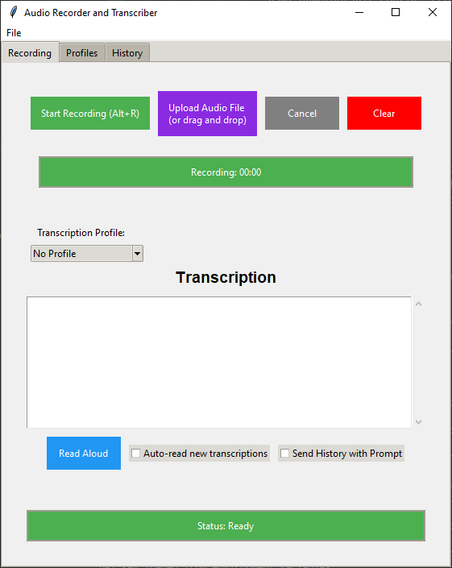
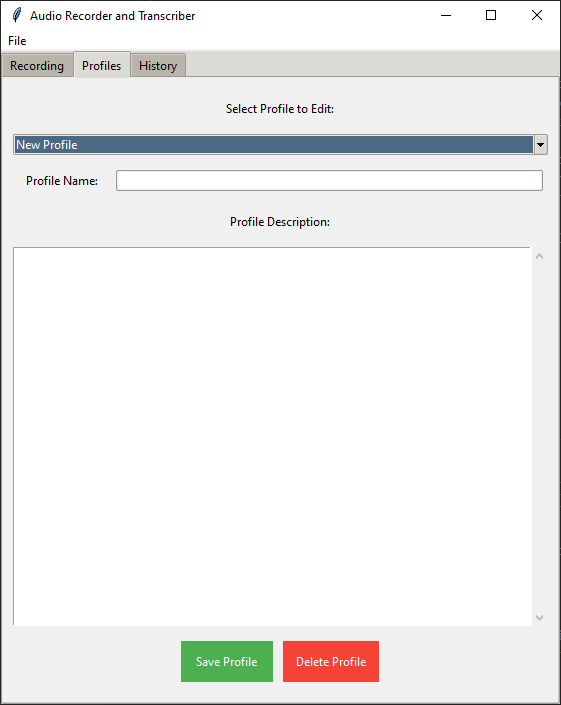
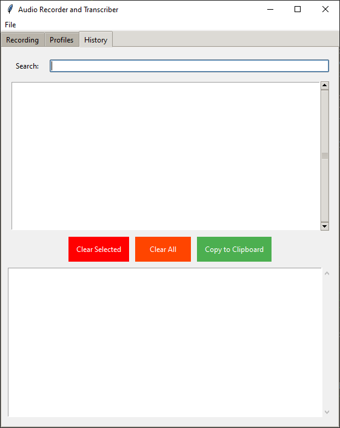
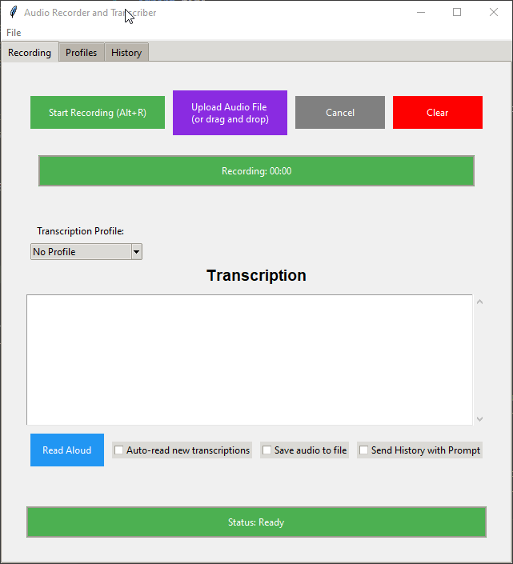
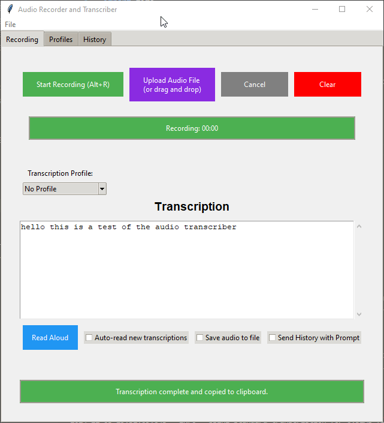

# Audio Recorder and Transcriber

A powerful desktop application for recording, transcribing, and managing audio content using OpenAI's Whisper API.







## Features

- 🎙️ **Audio Recording**: Record audio directly from your microphone
- 📝 **Transcription**: Convert speech to text using OpenAI's Whisper API
- 📁 **File Support**: Upload or drag-and-drop audio files (.wav, .mp3, .ogg, .flac)
- 🔊 **Text-to-Speech**: Read transcriptions aloud using OpenAI's TTS API
- 📋 **History Management**: Save and manage transcription history
- 👤 **Profile System**: Create and use custom transcription profiles
- 🔑 **Secure API Key Storage**: Safely store your OpenAI API key
- ⌨️ **Global Hotkeys**: Control recording with keyboard shortcuts

## Quick Start

1. Clone the repository:
```bash
git clone https://github.com/Knuckles92/AI-Audio-Tool.git
cd AI-Audio-Tool
```

2. Add your OpenAI API key in one of these ways:
   - Enter it in the app's settings tab
   - Set it as the `OPENAI_API_KEY` environment variable
   - Create a `.env` file with: `OPENAI_API_KEY=your-api-key-here`

3. Start using the app! Click "Start Recording" or press `Alt+R` to begin.

## Prerequisites

- Python 3.8 or higher
- FFmpeg installed on your system
- OpenAI API key
- Active internet connection

## Installation

1. Clone the repository:
```bash
git clone https://github.com/Knuckles92/AI-Audio-Tool.git
cd AI-Audio-Tool
```

2. Install required dependencies:
```bash
pip install -r requirements.txt
```

3. Install FFmpeg:
   - Windows: Download from [FFmpeg website](https://ffmpeg.org/download.html)
   - Mac: `brew install ffmpeg`
   - Linux: `sudo apt-get install ffmpeg`

## Configuration

1. Launch the application
2. Enter your OpenAI API key when prompted
   - The API key will be securely stored using the system keyring
   - Alternatively, set the `OPENAI_API_KEY` environment variable
   - You can also set the API key in the settings tab
   - You can also set the api key in the config.yaml file

## Usage

### Basic Recording

1. Click "Start Recording" or press `Alt+R`
2. Speak into your microphone
3. Click "Stop Recording" or press `Alt+R` again
4. Wait for transcription to complete

### File Upload

- Click "Upload Audio File" or drag and drop an audio file
- Supported formats: .wav, .mp3, .ogg, .flac

### Profiles

1. Go to the Profiles tab
2. Create a new profile with specific instructions
3. Select the profile before recording/transcribing
4. The transcription will be processed according to profile settings

### History

- View past transcriptions in the History tab
- Search through previous transcriptions
- Export history to TXT, DOCX, or PDF
- Copy transcriptions to clipboard

### Settings

Access settings through File > Settings to configure:
- Save location for files
- Audio quality settings
- Dark/Light mode
- API settings
- Profile models

## Keyboard Shortcuts

- `Alt+R`: Start/Stop Recording
- `Alt+C`: Cancel Recording/Transcription

## Troubleshooting

1. **No audio input detected**
   - Check microphone permissions
   - Verify default input device in system settings

2. **API errors**
   - Verify internet connection
   - Check API key validity
   - Ensure sufficient API credits

3. **FFmpeg issues**
   - Verify FFmpeg installation
   - Add FFmpeg to system PATH

## Contributing

1. Fork the repository
2. Create a feature branch
3. Commit your changes
4. Push to the branch
5. Create a Pull Request

## License

This project is licensed under the MIT License - see the [LICENSE](LICENSE) file for details.

## Acknowledgments

- OpenAI for Whisper and TTS APIs
- FFmpeg for audio processing
- All contributors and users
- Aider
- Cline
- Anthropic/Claude
- Deepseek
- Openrouter

## Support

For support, please:
1. Check the [Issues](https://github.com/Knuckles92/AI-Audio-Tool/issues) page
2. Create a new issue if needed
3. Create a discussion in the repository

---
Made by Knuckles92
